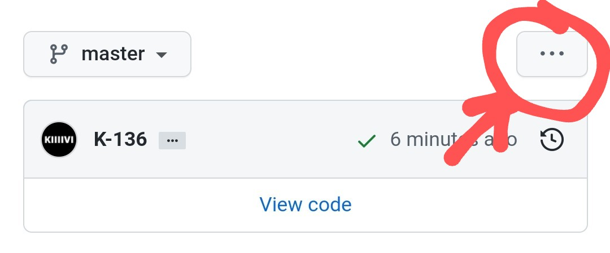
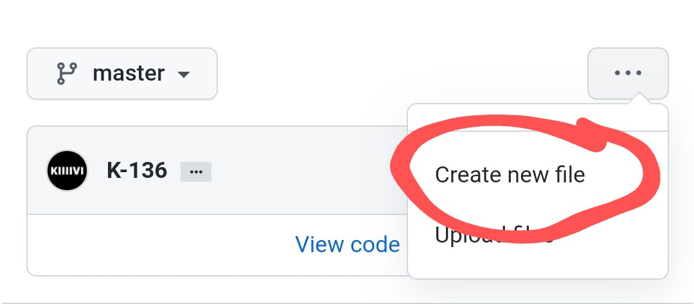

# CODEDbio

## Bio for everyone 

> https://bio.coded.top/yourname

You can create your own page even if you sus at programming or coding.

You only have to do just follow these steps below :)


### 1 Copy this and fill it with your details 


```markdown
---
title: "" # Replace this with your file name

draft: false # Don't touch this X(

bgcolor: "" # Default is "black"

textcolor: "white" # If you don't change this Defalult is white , if you use light color for bg leave it empty or if you you use dark color for bg use light color


name: "" # Username. like MinionHunter, SmurfKiler, RabbitEater ... this will work as your username

userpic: "" # Profile Image LINK . you must add this. You can use any image svg/png/jpg/gif any

status: "" # Anything about you (use one or 3 word(s) for better looking)

# If you don't have any of those things just leave them empty read docs for more https://docs.coded.top

twitter: "" # Twitter username
telegram: "" # Telegram username without @
github: "" # Github username
youtube: "" # Youtube channel url
buymeacoffee: "" # Buymeacoffee username
patreon: "" # Your patreon username 

---

<!-- Use this area for introduce yourself 'USE MARKDOWN'-->


```

Example -


```markdown
---
title: "Hello"

draft: false

bgcolor: "" 

textcolor: "white" 

name: "MizuharaChizru"

userpic: "https://data.whicdn.com/images/305680740/original.gif"

status: "a self taught web dev"


twitter: "mizuharaChizru"
telegram: "mizuharachizru" 
github: "K-136"
youtube: ""
buymeacoffee: "mizuhara"
patreon: "kurzgesagt"
---

<!-- Use this area for introduce yourself 'USE MARKDOWN'-->

## Nothing About me. I'm just another looser 

```
#### Demo - [Mizuhara](https://bio.coded.top/mizuhara)


## 2 Create new file and pull request

### Follow this Image tutorial 


<br/>


### Watch this video

<a href="">Create file and create Pull request</a>

**Important your filename is your url**

Eg - if you name file as ```hello.md``` your url look like this ```https://bio.coded.top/hello```

## Notice

- This is manual process so you have to wait some time to recive your ```bio.coded.top/yourbio``` link
- Don't create more than 2 per day
- If you need to get **blue color verified icon** Contact me via Telegram [MizuharaChizru](https://t.me/MizuharaChizru)

## Support

[](//t.me/MizuharaChizru)

## Become a sponsor (Your name will visible in main page)

<a href="//www.buymeacoffee.com/Mizuhara" target="_blank"></a>


